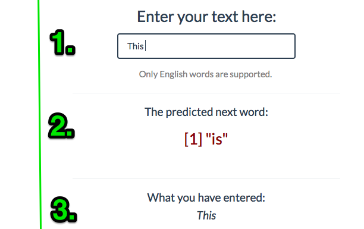

Coursera Data Science Capstone Project
========================================================

This Capstone Project evolves around the development of a shiny application, which is capable of predicting the word in a series of words.

The development required steps like data cleaning, exploratory analysis and creation of a predictive model. The Predictive model was created on the basis of the open source text data offered by [HC Corpora](http://www.corpora.heliohost.org/). The Predictive model has created a frequency dictionary based on this text data.

The Applied Methods & Models
========================================================

In the development of the App was created on base of the HC Corpora Data, which was cleaned and converted into a suitable format.

The Method for prediction used in this Project is creating a n-gram Dictionaries. First step is to [tokenized](http://en.wikipedia.org/wiki/Tokenization_%28lexical_analysis%29) into [*n*-grams](http://en.wikipedia.org/wiki/N-gram). 

<b>Definition ngrams:</b>
 In the fields of computational linguistics and probability, an *n*-gram is a contiguous sequence of n items from a given sequence of text or speech. ([Source](http://en.wikipedia.org/wiki/N-gram))

Those aggregated bi-,tri- and quadgram term frequency matrices have been transferred into frequency dictionaries. These are used to predict the next word in connection with the text input and the frequencies of the underlying *n*-grams table.

The Usage Of The Application
========================================================

This App prediction is based on the last word (sequence) that is entered by the user.  The Prediction is based on a maximum of the last 4 words entered, however more than 4 words can be entered. 
While entering the text (**1**), the field with the predicted next word (**2**) refreshes instantaneously and also the whole text input (**3**) gets displayed.

